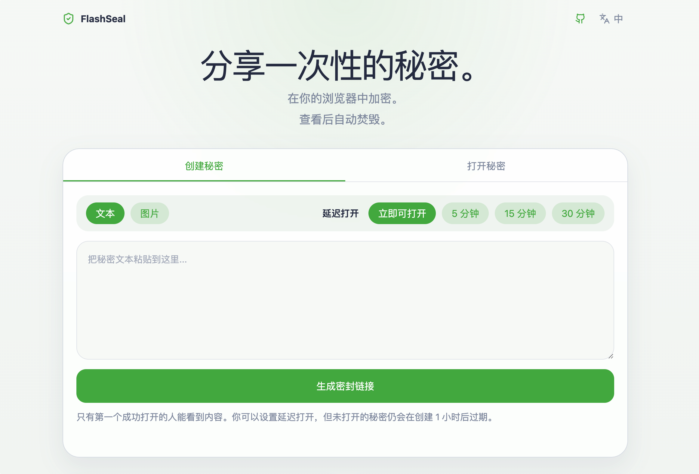

<div align="center">

# 🛡️ FlashSeal

**Encrypted burn-after-open text and image sharing on Cloudflare Pages and KV**

English | [简体中文](./README_ZH.md) | [日本語](./README_JA.md) | [한국어](./README_KO.md)

[](https://github.com/afetmin/FlashSeal/blob/master/LICENSE)
[](https://pages.cloudflare.com/)
[](https://developers.cloudflare.com/kv/)
[](https://www.typescriptlang.org/)

[Live Demo](https://flashseal.space/) | [Source Code](https://github.com/afetmin/FlashSeal) | [Deploy Guide](https://github.com/afetmin/FlashSeal#deploy-to-cloudflare-pages) | [Report Issue](https://github.com/afetmin/FlashSeal/issues) | [License](https://github.com/afetmin/FlashSeal/blob/master/LICENSE)

</div>

---

FlashSeal is an encrypted burn-after-open sharing tool for text and images, built on Cloudflare Pages, Pages Functions, and KV.
The page ships without a heavy runtime framework on the client.

## Preview



## Features

- `🛡️ End-to-End Encryption` Encrypts secrets in the browser before upload, so the server stores ciphertext only.
- `🔥 Burn After Open` Each secret can be opened successfully only once, which keeps sharing intentionally ephemeral.
- `📝 Text And Image Support` Share both text snippets and images in one lightweight workflow, with image uploads up to `15MB`.
- `📋 Paste To Upload` Drop images in quickly with clipboard paste support instead of manual file picking every time.
- `🔗 Key-In-Fragment Links` Secrets are shared as direct links like `/s/:id#k=<base64url-key>`, keeping the decryption key on the client side.
- `⏱️ Delayed Opening` Hold access until a chosen unlock window of `5`, `15`, or `30` minutes.
- `⌛ Timed Self-Destruct View` Once opened, the decrypted content stays visible for `60 seconds` before disappearing.
- `🗑️ Automatic Expiration` Unopened secrets are purged after `1 hour`, including those created with delayed opening enabled.
- `⚡ Lightweight Frontend` Ships without a heavy client runtime framework, keeping the sharing page fast and focused.

## Stack

- Svelte 5
- Vite 7
- Tailwind CSS 4
- Cloudflare Pages
- Cloudflare Pages Functions
- Cloudflare KV
- TypeScript for frontend app and Pages Functions

## Project Structure

- `src/`: Svelte app source, UI components, shared browser logic, and styles
- `static/`: static assets copied into the final build
- `public/`: generated build output for Cloudflare Pages deployment
- `functions/api/secrets/index.ts`: create-secret endpoint with delayed-open configuration
- `functions/api/secrets/[id]/open.ts`: first-open endpoint with unlock-time enforcement
- `functions/api/i18n.ts`: API-side message dictionary
- `vite.config.js`: Vite build configuration
- `svelte.config.js`: Svelte compiler configuration
- `wrangler.toml`: Pages and KV configuration

## Requirements

- Node.js `20+`
- npm
- A free Cloudflare account
- Wrangler 4, installed through project dependencies

## Local Development

### 1. Install dependencies

```bash
cd /Users/yilun/Desktop/FlashSeal
npm install
```

### 2. Authenticate Wrangler

Use one of these options:

- Run `npx wrangler login`
- Or export `CLOUDFLARE_API_TOKEN` in your shell

The KV namespace creation commands require Cloudflare authentication.

### 3. Create KV namespaces

Create both production and preview namespaces:

```bash
npm run kv:create
npm run kv:create:preview
```

Wrangler will print the namespace IDs. Copy them into [wrangler.toml](/Users/yilun/Desktop/FlashSeal/wrangler.toml):

```toml
[[kv_namespaces]]
binding = "SECRETS"
id = "your-production-kv-id"
preview_id = "your-preview-kv-id"
```

### 4. Start local Pages development

```bash
npm run dev
```

FlashSeal uses these local settings:

- app port: `8788`
- inspector port: `9230`
- local state dir: `./.wrangler/state`
- frontend build output: `public/`

Then open:

```text
http://127.0.0.1:8788
```

### 5. Verify the main flow locally

1. Create a text or image secret
2. Optionally set delayed opening to `5`, `15`, or `30` minutes
3. Copy the generated link
4. Open that link in a new tab or window
5. If delayed opening is enabled, confirm the UI shows that the secret is still locked
6. After the unlock time, confirm the secret opens automatically
7. Confirm the countdown runs for 60 seconds
8. Confirm the same link cannot be opened again

### Local troubleshooting

- If `wrangler` commands fail after an upgrade, use the scripts in `package.json` or `npx wrangler ...`
- If the UI looks stale, clear the service worker and site storage in DevTools
- If KV creation fails, confirm you are logged in or `CLOUDFLARE_API_TOKEN` is set
- If local development fails on an older Node version, upgrade to Node 20+
- Do not open `public/index.html` directly as a static file preview. This project expects Cloudflare Pages routing and generated assets.

## Deploy To Cloudflare Pages

### Option 1: Connect the GitHub repository in the Cloudflare dashboard

1. Push this project to a Git repository
2. In Cloudflare, open `Workers & Pages`
3. Create a new `Pages` project and connect the repository
4. Use these build settings:
   - Build command: `npm run build`
   - Build output directory: `public`
5. Create or choose a KV namespace for production
6. In the Pages project settings, add a KV binding:
   - Variable name: `SECRETS`
   - Namespace: your production namespace
7. Save and deploy

### Option 2: Prepare the config first, then connect Pages

Before connecting the repo, make sure [wrangler.toml](/Users/yilun/Desktop/FlashSeal/wrangler.toml) contains your real namespace IDs:

```toml
name = "flashseal"
compatibility_date = "2026-03-11"
pages_build_output_dir = "./public"

[[kv_namespaces]]
binding = "SECRETS"
id = "your-production-kv-id"
preview_id = "your-preview-kv-id"
```

Then connect the repo in Pages and keep:

- Build command: `npm run build`
- Output directory: `public`

## License

[MIT](LICENSE)
